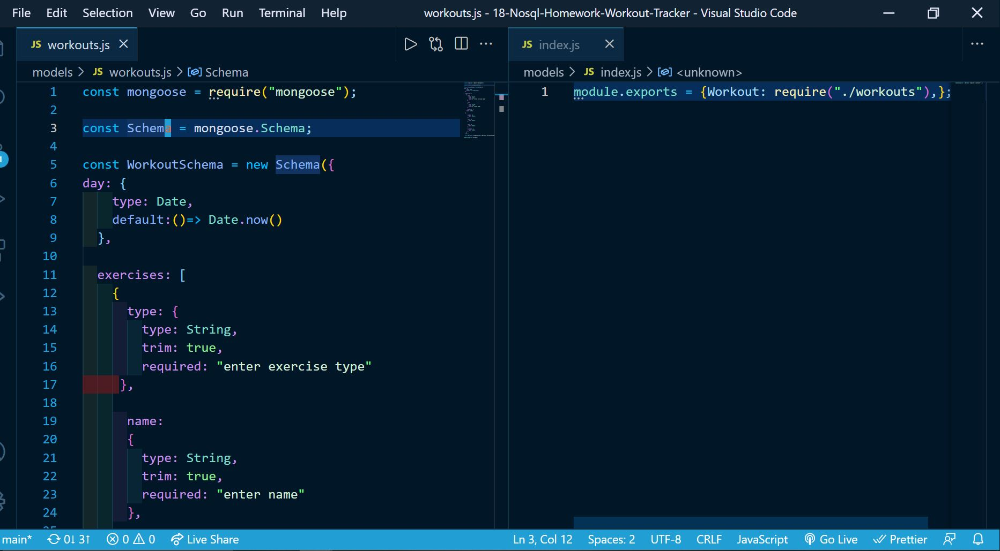
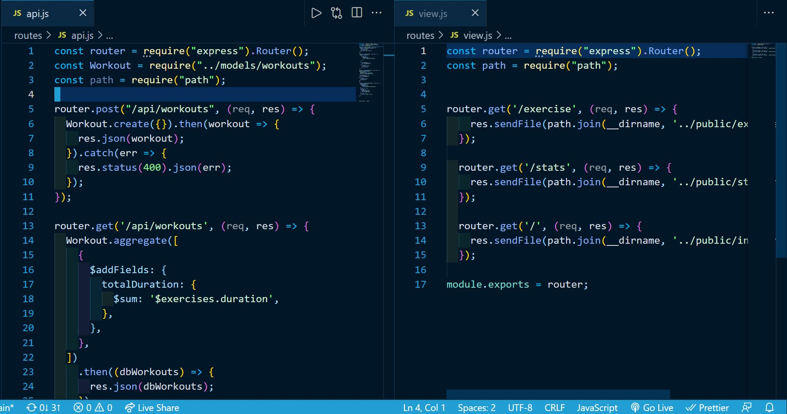
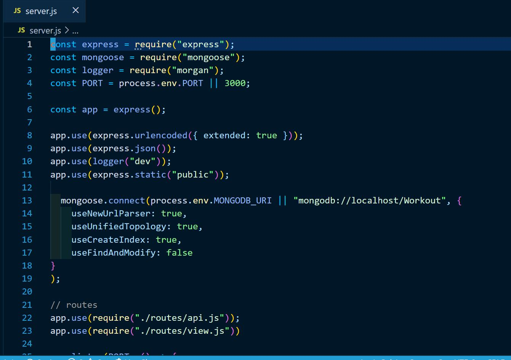
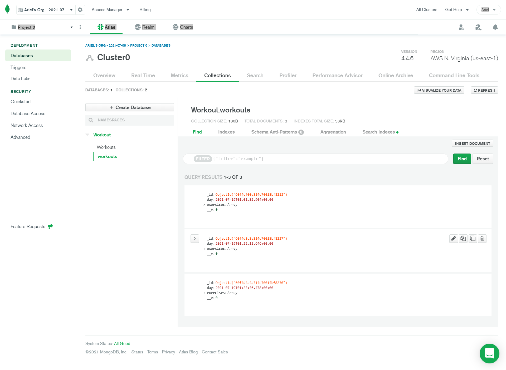
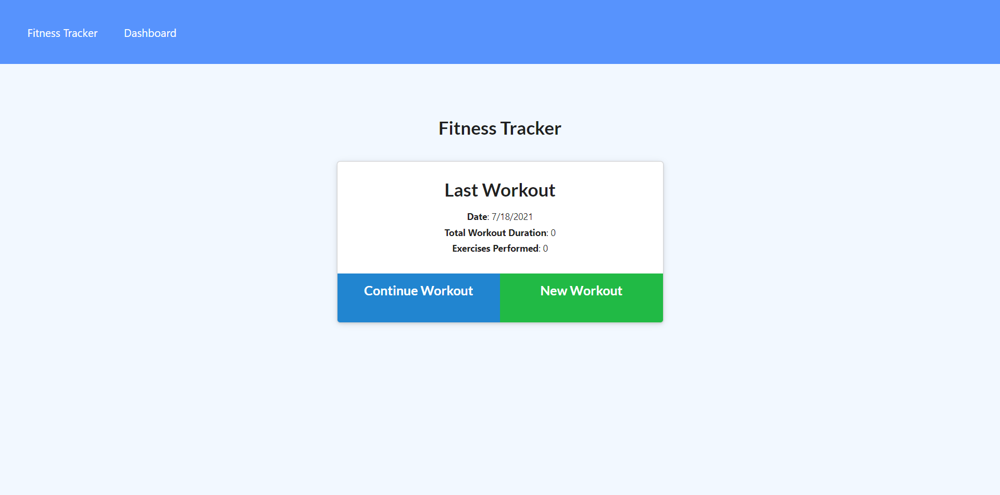
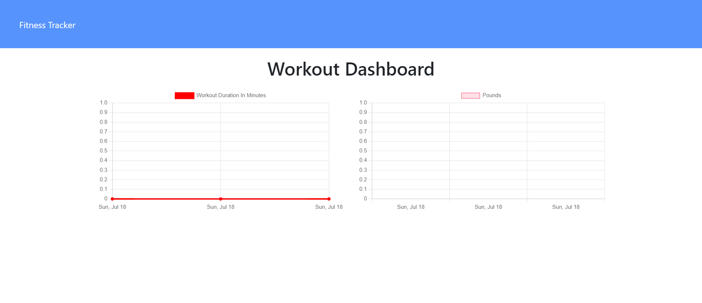

# 18-Nosql-Homework-Workout-Tracker
## Introduction:
For this assignment, I created a workout tracker. I was provided with the front end starter code. This assignment required us to create a Mongo database with a Mongoose schema and handle routes with Express.

I created a demo app that you can use on this link:
 [Fitness Tracker app](https://guarded-cliffs-88585.herokuapp.com/?id=60f4d3c3a314c70015bf8227)

 
 

## Technologies used:

* Java Script
* mongodb
* mongodb atlas
* heroku
* express
* mongoose
* morgan

 
 

### Screenshot of Model Code

 
 

### Screenshot of Routes code

 
 

### Screenshot of server

 
 

### Screenshot of Mongo Atlas workout database

### Finished Heroku app screenshot

 
 

### Finished Heroku app screenshot

